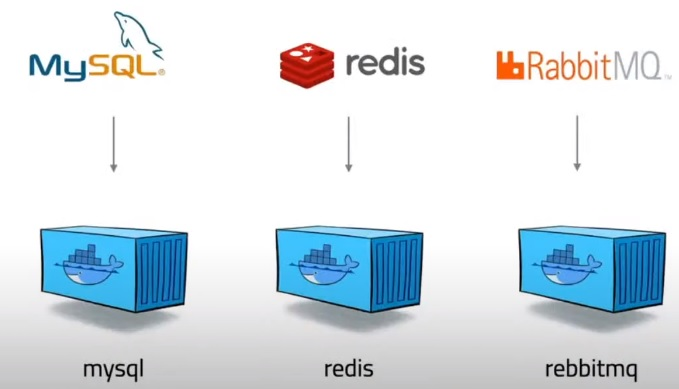
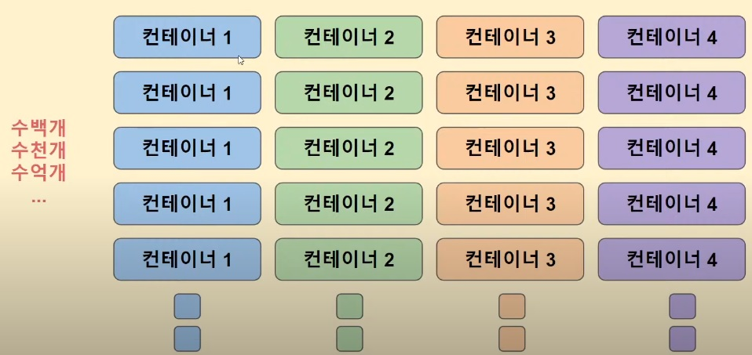

[toc]

## container?

컨테이너는 **독립된 리눅스 환경을 보장받는** 프로세스다.  
( `namespace` 와 `cgroup` 을 적용한 프로세스 )

> `namespace` : 무엇을 볼 수 있는지(see) **제한**  
> `cgroup` : 얼마나 사용(use)가능 한지 **제한**

> ex) 웹 개발자 입장에서  
> 이것저것 깔아서 충돌나는 배포 환경을 고려하지 않아도 된다.  
> 운영자 입장에서는  
> 라이브러리 버전이 겹쳐도 상관없다.

App을 각각 컨테이너화  

>

## 도커, 컨테이너를 통한 여러대의 서버 관리에는 한계가 생긴다.

이를 해결하기 위해 컨테이너 오케스트레이션 기술인 **쿠버네티스(Kubernetes)**가 만들어졌다.

> 1주일에 20억개 컨테이너를 생성하는 구글 서버 관리용
> borg 내부 도구를 2015년 오픈소스화.   

## Cloud

특징

- On Demand, 대규모 확장성 : 원하는 시점에 대규모로 IT 자원 확장이 가능

- 종량제 과금 : 사용한 만큼만 지불

- 관리의 편리성 : Cloud 사업자들이 IT 자원 관리 기능을 제공

  

Service Model

- Iaas (Infrastructure as a Service) 

  - IT 기본 자원만 제공
- Server, Storage, Network
  - AWS EC2

  -> 컴퓨터를 제공

  

- Paas (Platform as a Service)
  - IaaS에 OS, Middleware, Runtime 추가
    - Middleware : RDBMS
    - Runtime : JDK, Python 등 프로그램이 작동하는 환경
  - 코드 개발만 해서 올릴 수 있는 상태
  - AWS Elastic Beanstalk, Google App Engine

   -> code만 개발해서 배포하면 되는 환경을 제공

  
  
- Saas (Software as a Service)

  - 모든 기능이 동작하는 SW를 제공
  - 네이버 클라우드, 구글 드라이브, Office 365, Dropbox
  
  -> 돈만 내면 모든 것을 제공
  
  

Deployment Model

- Public
- Private
- Hybrid Cloud

Region : Data Center가 위치한 지역

- Region 선택은 서비스 성능에 큰 영향을 미침
- 대상 고객의 지역과 자원 생성 할 Region이 최대한 가까워야 함
- 자원 사용 비용이 Region 마다 다름

Availability Zone

- 하나의 Region은 두 개 이상의 가용 영역(AZ)으로 구성 됨
- 하나의 AZ는 하나의 Data Center
- 서비스를 단일 Data Center(AZ) 에서만 운영하면 장애시 해당 Data Center(AZ)가 복구 될 때까지 접속 불가
- 서비스를 다수의 Data Center(AZ)에 분산 운영하면 특정 Data Center(AZ)에 문제가 생겨도 다른 Data Center(AZ) 접속 가능  => Availability가 높다.

